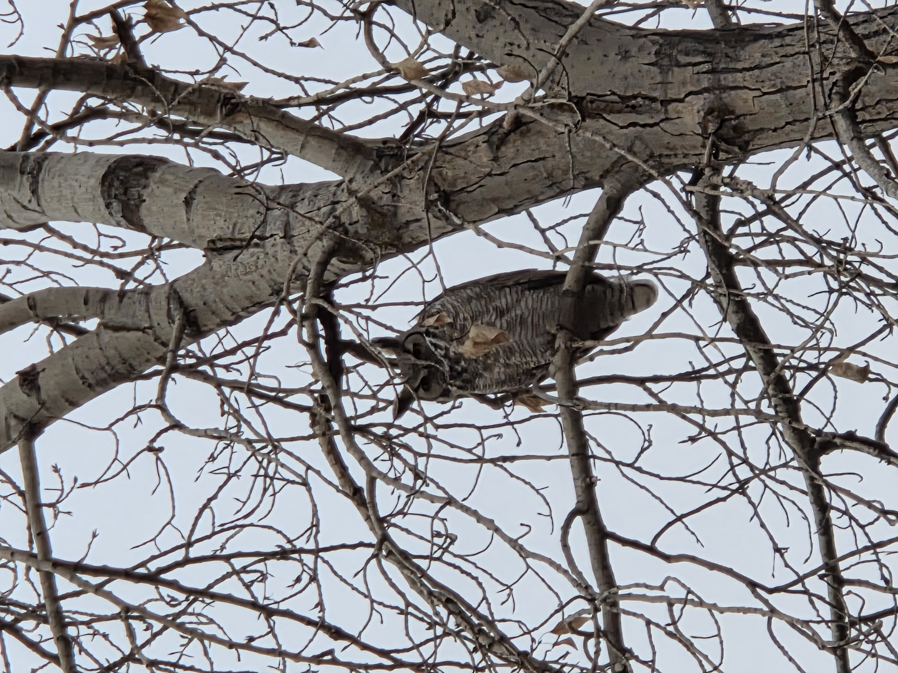

# Data_Course_DECKER
This README file contains information about my uploaded assignments

This is a test change for this file.
Here is a list of recent birds I've seen:
Ring-billed Gull,
Great Horned Owl,
Common Merganser,
Townsend's Solitaire,
Pied-billed Grebe,
Franklin's Gull,
Spotted Sandpiper

